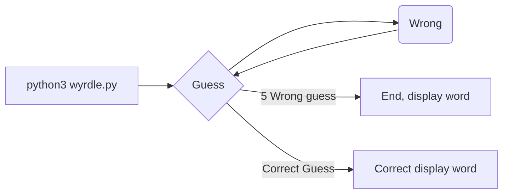

# flow.md

```mermaid
---
Title: wydle.py
---
flowchart LR
    A[python3 wyrdle.py] --> B{Guess}
    B --> C(Wrong) --> B
    B -->|5 Wrong guess| D[End, display word]
    B -->|Correct Guess| E[Correct display word]
```
