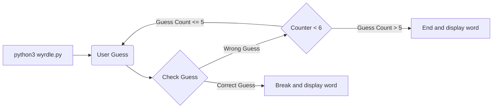

# flow.md

```mermaid
---
Title: wydle.py
---
flowchart LR
    A[python3 wyrdle.py] --> B(User Guess)
    B --> C{Check Guess}
    C --> |Wrong Guess| F{Counter < 6} 
    C --> |Correct Guess| D[Break and display word]
    F --> |Guess Count <= 5| B
    F --> |Guess Count > 5| G[End and display word]
```
